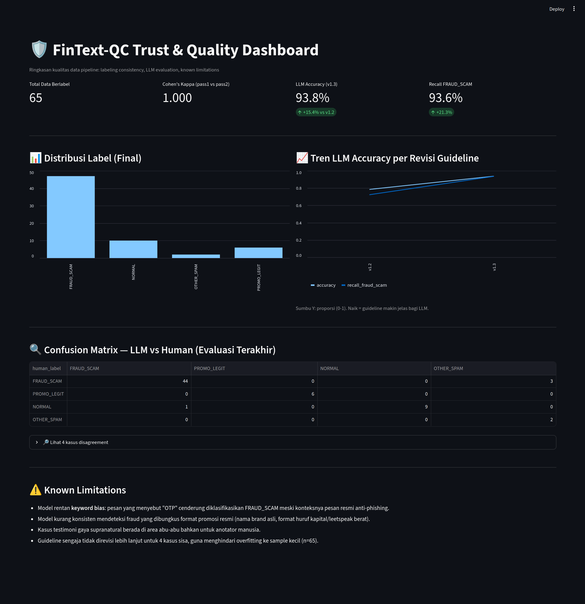

# FinText-QC — Fraud/Scam Text Labeling & Data Quality Pipeline

Simulasi end-to-end pipeline untuk mengumpulkan, memvalidasi, melabeli, dan
mengukur kualitas data teks terkait fraud finansial berbahasa Indonesia —
dirancang untuk mencerminkan proses penyiapan data training LLM di konteks
platform pembayaran digital.

## Kenapa Proyek Ini Dibuat

Dibuat untuk mendalami proses **data collection, validation, labeling, dan
quality assurance** untuk teks berbahasa Indonesia — area yang jarang
disentuh proyek data science pada umumnya (yang biasanya fokus ke model
building, bukan proses di baliknya).

## Arsitektur

```
Raw SMS Data (public dataset + manual seed)`
        │
        ▼
[Go] Ingestion Service — validasi, dedup, cleaning
        │
        ▼
[Python/Streamlit] Manual Labeling Tool — dual-pass annotation
        │
        ▼
[Python] Quality Analysis — Cohen's Kappa, disagreement detection
        │
        ▼
[Groq LLM] AI-Assisted Labeling — evaluasi & validasi silang
        │
        ▼
[Python/Streamlit] Trust & Quality Dashboard
```

## Tech Stack

| Komponen | Tools |
|---|---|
| Data Ingestion & Validation | Go |
| Manual Labeling Tool | Python, Streamlit |
| Quality Metrics | Python, scikit-learn (Cohen's Kappa) |
| AI-Assisted Labeling | Groq API (openai/gpt-oss-20b) |
| Dashboard | Python, Streamlit, Pandas |

## Metodologi & Hasil

### 1. Labeling Guideline
Guideline ([`guideline/LABELING_GUIDELINE.md`](guideline/LABELING_GUIDELINE.md)) mendefinisikan 4 kategori:
`FRAUD_SCAM`, `PROMO_LEGIT`, `NORMAL`, `OTHER_SPAM`. Direvisi 3 kali (v1.1 →
v1.3) berdasarkan temuan empiris dari proses labeling & evaluasi, bukan
disusun sekali jadi di awal.

### 2. Data Sourcing
Dataset publik [Indonesia SMS Spam Dataset](https://github.com/bopbi/indonesia-sms-spam-dataset)
(kategori `loan` & `prize`, paling relevan finansial) dikombinasikan dengan
seed data NORMAL/PROMO_LEGIT buatan manual, karena sumber publik yang
tersedia murni berisi spam tanpa contoh pesan legit — keterbatasan ini
didokumentasikan secara eksplisit, bukan disembunyikan.

### 3. Inter-Annotator Agreement
Melabeli 65 data dalam 2 pass independen, dibandingkan dengan Cohen's Kappa:

| Metrik | Nilai |
|---|---|
| Agreement rate (raw) | 95.38% |
| **Cohen's Kappa** | **0.901** (*almost perfect*, skala Landis & Koch) |
| Disagreement cases | 3 dari 65 |

Analisis 3 kasus disagreement mengungkap **guideline v1.1 terlalu sempit**
(cuma cakup phishing OTP/PIN), sehingga direvisi ke v1.2 untuk mencakup
hidden-fee trap & harga tidak wajar.

### 4. LLM-Assisted Labeling & Guideline Iteration
Model `openai/gpt-oss-20b` (via Groq) dipakai sebagai "annotator ketiga"
untuk validasi silang terhadap label manusia:

| Versi Guideline | Accuracy | Recall FRAUD_SCAM |
|---|---|---|
| v1.2 | 78.46% | 72.34% (34/47) |
| **v1.3** | **93.85%** | **93.62% (44/47)** |

Root cause gap v1.2 → v1.3: guideline tidak eksplisit mencakup pola
**pinjaman online ilegal** (40% dari dataset), sehingga model salah
mengklasifikasikannya sebagai OTHER_SPAM. Setelah revisi, recall naik
signifikan tanpa menurunkan precision kategori lain.

### 5. Known Limitations
4 kasus disagreement tersisa (setelah v1.3) sengaja **tidak** dipatch lebih
lanjut untuk menghindari overfitting guideline ke sample kecil (n=65):
- Model menunjukkan **keyword bias**: pesan yang menyebut "OTP" cenderung
  diklasifikasikan FRAUD_SCAM meski konteksnya pesan resmi anti-phishing.
- Model kurang konsisten pada fraud yang dibungkus format promosi resmi
  (brand asli, leetspeak berat).
- Satu kasus (testimoni gaya supranatural) berada di area abu-abu bahkan
  untuk anotator manusia.

## Preview Dashboard



## Cara Menjalankan

```bash
# 1. Ingestion & validasi data
cd ingestion && go run main.go -input=../data/raw/raw_sms.csv

# 2. Labeling manual (2 pass)
streamlit run labeling_tool/app.py -- --pass_name pass1
streamlit run labeling_tool/app.py -- --pass_name pass2

# 3. Resolusi label final & analisis agreement
python quality/resolve_final_labels.py
python quality/agreement.py

# 4. LLM-assisted labeling (butuh GROQ_API_KEY di .env)
python quality/llm_annotator.py

# 5. Dashboard
streamlit run dashboard/dashboard.py
```

## Struktur Proyek

```
fintext-qc/
├── guideline/LABELING_GUIDELINE.md   # v1.0 -> v1.3, riwayat revisi lengkap
├── ingestion/                        # Go: validasi & cleaning data
├── labeling_tool/                    # Python: tool pelabelan manual
├── quality/                          # Python: metrik & LLM evaluation
├── dashboard/                        # Python: trust/quality dashboard
└── data/                             # raw, processed, labeled (gitignored)
```

## Catatan
Dataset asli bersumber dari repositori publik CC0 (bebas pakai). Seed data
NORMAL/PROMO_LEGIT dibuat manual untuk keperluan demonstrasi, bukan data
transaksi nyata dari pengguna manapun.

